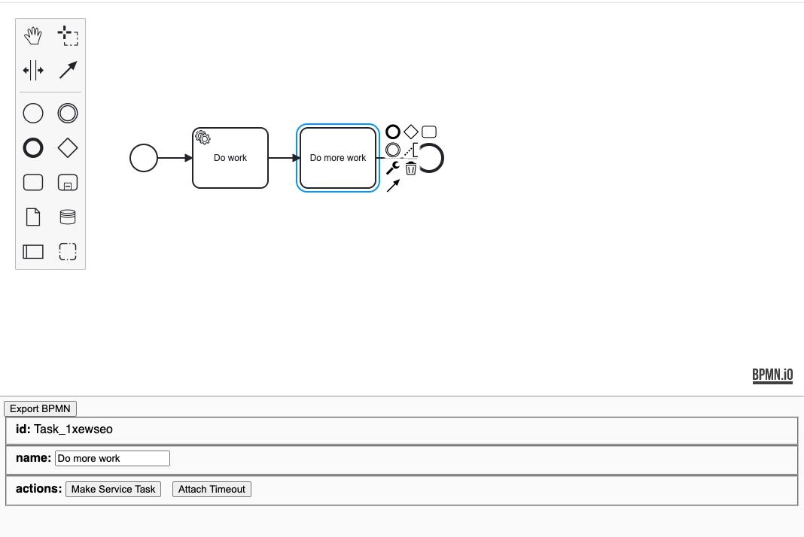

# Svelte Properties Panel for bpmn-js

(!) This is a ported version of [bpmn-js-example-react-properties-panel](https://github.com/bpmn-io/bpmn-js-example-react-properties-panel)

This example demonstrates a custom properties panel for [bpmn-js](https://github.com/bpmn-io/bpmn-js) written in [Svelte](https://kit.svelte.dev/)



## About

The component [`PropertiesView`](https://github.com/bpmn-io/bpmn-js-example-react-properties-panel/blob/master/app/properties-panel/PropertiesView.js) implements the properties panel.

The component is rendered as a standard svelte component and receives the BPMN modeler instance as props:

```js
ReactDOM.render(<PropertiesView modeler={modeler} />, container);
```

As part of its life-cycle hooks it hooks up with bpmn-js change and selection events to react to editor changes:

```js
  onMount(() => {
    modeler.on("selection.changed", (e: any) => {
      selectedElements = e.newSelection;
      element = e.newSelection[0];
    });

    modeler.on("element.changed", (e: any) => {
      if (!element) {
        return;
      }

      // update panel, if currently selected element changed
      if (e.element.id === element.id) {
        element = e.element;
      }
    });
  });
```

## Developing

Once you've created a project and installed dependencies with `npm install` (or `pnpm install` or `yarn`), start a development server:

```bash
npm run dev

# or start the server and open the app in a new browser tab
npm run dev -- --open
```

## Building

To create a production version of your app:

```bash
npm run build
```

You can preview the production build with `npm run preview`.

> To deploy your app, you may need to install an [adapter](https://kit.svelte.dev/docs/adapters) for your target environment.

## License

MIT
